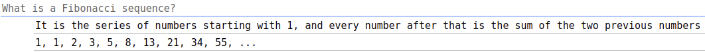
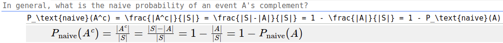
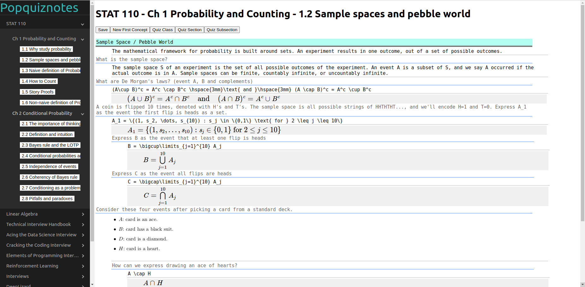

# Popquiznotes

    

Popquiznotes is a notetaking app where users write questions and notes concurrently, then receive a *pop quiz* on their *notes*.

## Contents
[1. Motivation](#1-motivation)\
[2. Popquiznotes Approach](#2-popquiznotes-approach)\
[3. Design](#3-design)\
[4. Phase 2](#4-phase-2)

## [1. Motivation](#1-motivation)
The purpose of this project is to create a more efficient way to study.

Normally, students take notes during their classes and only review them when they need to, usually before a test.
The problem is, studying notes is not very useful.

People learn and retain knowledge much better when they're forced to recall the information without any help.
Ambitious students may get around this by making a study guide or practice test for themselves, but that's very time-consuming.

It would be much better if a student could take notes on something and immediately be given a popquiz on their notes.

## [2. Popquiznotes Approach](#2-popquiznotes-approach)

Popquiznotes aims to eliminate this problem by creating a quiz at the same time a student takes notes.

As a student takes notes, they are also able to write a question like this:

    

This way, when the student is finished taking notes, they can instantly be quizzed on them.

## [3. Design](#3-design)

### Languages/Frameworks
<!-- built with React JS -->
Popquiznotes is built with HTML, CSS, React.js, AWS, and MongoDB.

Images are stored in S3 buckets within AWS.
All note data is stored in MongoDB databases and accessed using MongoDB Realm functions.
MongoDB Realm also provides the hosting for the site.

### Site Structure
The site is divided into four main parts: the sidebar, header, and main section, which can display either notes or a quiz.

The sidebar is always present, and allows you to choose which class/section/subsection you'd like to view.

The header is always present too.
It displays the name of the current class/section/subsection, and allows you to navigate between looking at notes and taking a quiz.

### Class Structure
Every class a user creates is displayed in the sidebar.
Classes contain sections, which contain subsections.
For example, the class "STAT 110" may have subsections "Ch 1" and "Ch 2", with subsections "Ch 1.1", "Ch 1.2", "Ch 2.1", and "Ch 2.2".

### Notes Structure
<!-- concept-notes-question-answer setup -->
The notes section is organized by concepts. 
Each concept has a title, notes section, and a series of question-answer pairs.

Unlike the question-answer pairs, the notes are intended to store information that doesn't necessarily need to be quizzed on.

Each subsection in a class can have as many concepts as needed, and each concept can have any amount of notes and question-answer pairs.

### Latex
Unlike most online note-taking apps, Popquiznotes has the ability to display any complex math equation that can be written in LaTeX.

When a user presses Control+L on a note, the note will be converted to LaTeX.
The raw LaTeX is displayed in the note itself, and a new section displaying the equation is shown below.

    

### Quiz Structure

### Example:

    

## [4. Phase 2](#4-phase-2)

### Frontend Improvements
The general UI/UX of the site could be better.
At the moment this site is built for my own personal use, so this isn't a huge problem.
However, if this app were to be opened up to multiple users, it would be a good idea to make it more user-friendly.

### AI-Generated Questions
As of now, users type in both the questions and the answers. 
To make this app even more useful, I think it would be a good idea to train AI to generate questions from the users' notes/answers.
That way, the users could take notes like usual, and as soon as they're done the AI would have a quiz ready for them.

### AI-Selected Questions
Similarly, quizzes are currently created using a simple technique like choosing randomly, recently missed, never asked, etc.
A more effective approach may be to create another AI to choose questions that would be most helpful to the users.
For example, it could choose the top 10 questions that are most likely to improve the user's responses the next time they take a quiz.
